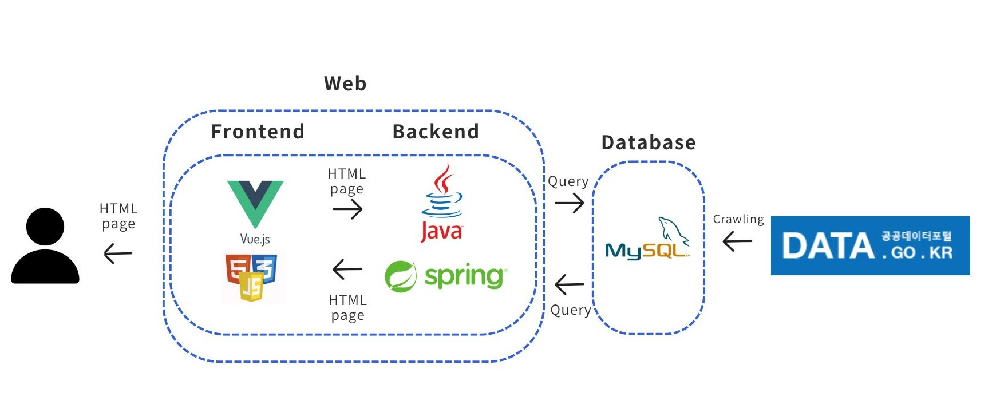
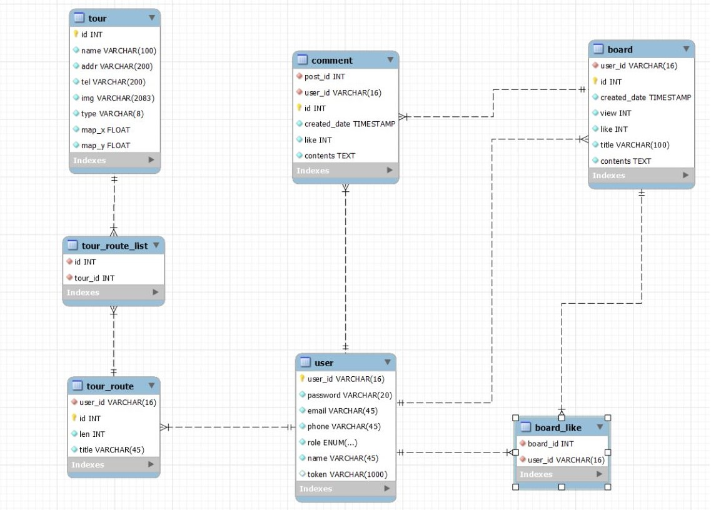

# 저기요 (EXCUSEME) 
> 공공데이터를 활용한 여행 통합 플랫폼 🗺

  

## 프로젝트 소개

### SSAFY 2024-1 파이널 관통 프로젝트 

### 📆 개발 기간 
> 2023.05(1개월)

### 🛠 기능 
#### 1. 가고자 하는 여행지 최단거리 추천

#### 2. 여행지 경로 정보 저장

#### 3. 여행지에 대한 정보 및 후기 공유 게시판

### 🖥 시연

#### 1. 메인화면

#### 2. 여행지 검색

#### 3. 여행지 추천

### 🛠 사용 기술
#### 백엔드

#### 프론트엔드

#### 디자인

### IA (Information Architecture)

### ERD 설계

